<!-- ::: {.hidden}
\DeclareMathOperator{\N}{\mathcal{N}}
\newcommand{\test}{f_{\text{test}}}
\renewcommand{\phi}{\varphi}
::: -->

```{=html}
<link href="https://cdn.jsdelivr.net/npm/bootstrap@5.3.0/dist/css/bootstrap.min.css" rel="stylesheet">
<script src="https://cdn.jsdelivr.net/npm/bootstrap@5.3.0/dist/js/bootstrap.bundle.min.js"></script>
```

::::{.center-page-vertically-2}
:::{.row}
::::{.col-8 .text-center }
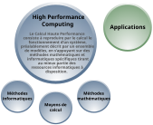{width="60%"}
::::
::::{.col-4 .align-self-center .border .fragment .border-2}

:::{.color-0}
**Plan**
:::

- Évolution des architectures, des mathématiques et des algorithmes
- Innovation scientifique et technologique : illustrations
- L’Initiative HPC@Maths et son impact à l’X

::::

:::
::::
---

:::{.center-page}
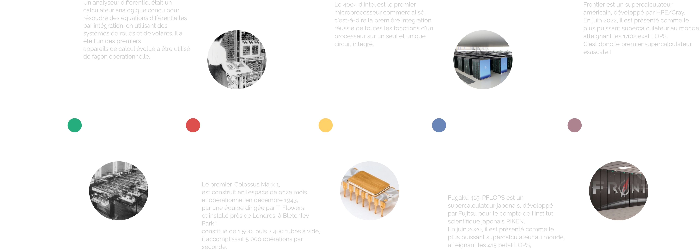
:::

---

:::{.center-page .r-stack}
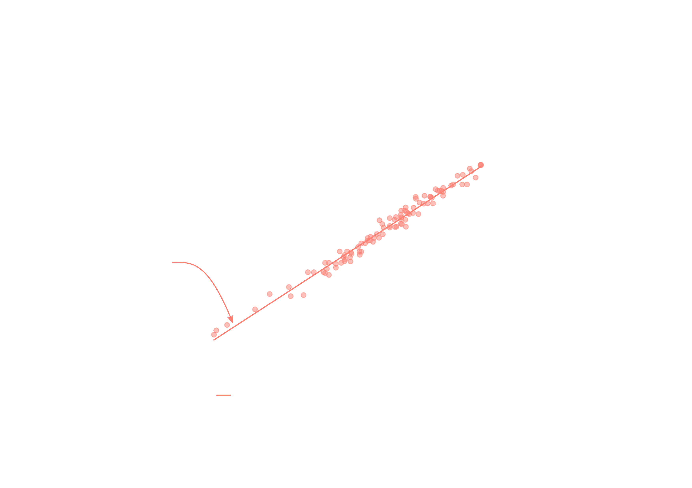{.fragment .fade-out data-fragment-index=0}

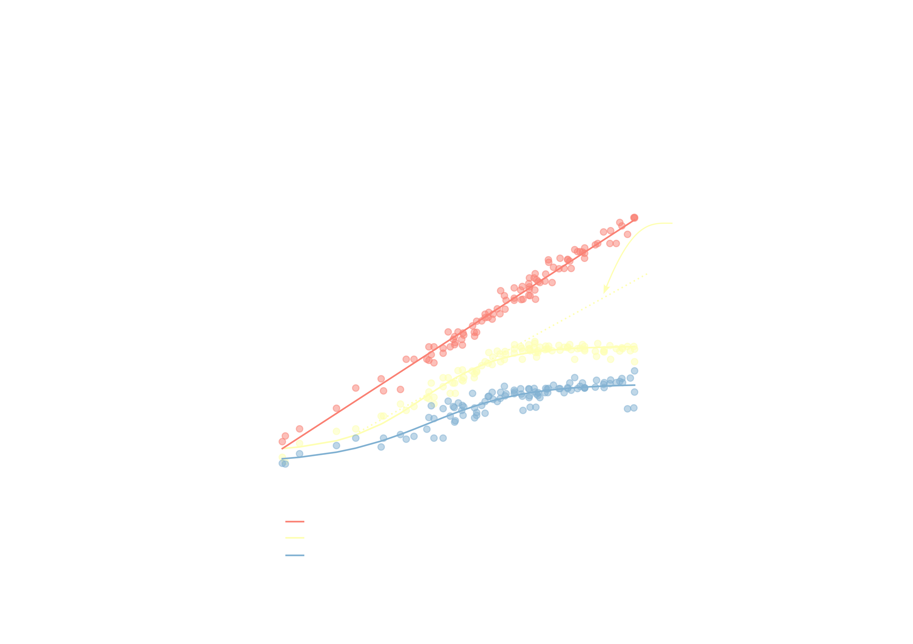{.fragment .current-visible data-fragment-index=0}

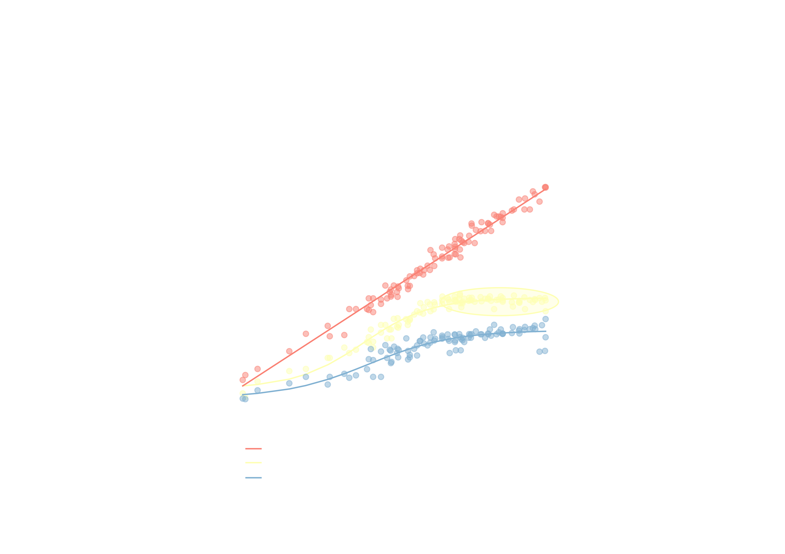{.fragment .current-visible}

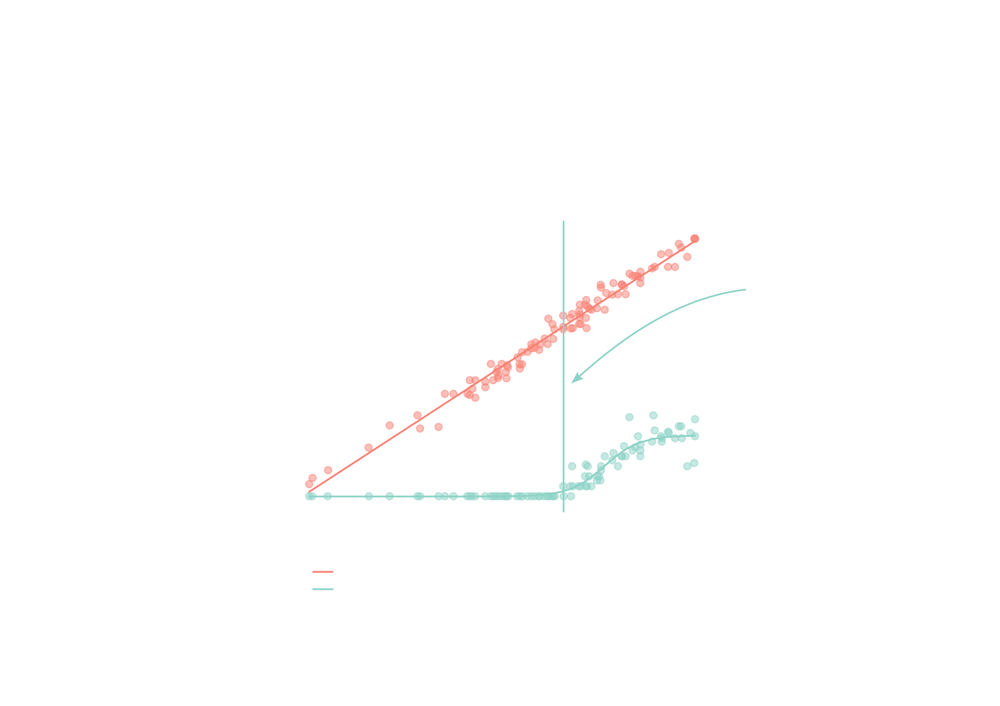{.fragment}
:::

---

::::{.center-page-vertically-2}
:::{.row}
::::{.col-7 .align-self-center .text-center}
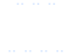{width="80%"}
::::
::::{.col .align-self-center}

**Une complexité à tous les étages**

- SIMD
- NUMA-aware
- Carte accélératrice (GPU, FPGA, …)
- Noeuds de calcul interconnectés

:::{.text-center .color-0}
**Mémoire non unifiée**
:::

<br>
**Une grande variété d’outils**

- OpenMP
- Cuda
- MPI
- OpenAcc
- ...

::::
:::
::::

## De l'autocomplétion à l'agent {.ai-slide}

```{=html}
<div class="ai-legend">
  <span class="ai-legend-key is-human">part portée par l'humain</span>
  <span class="ai-legend-key is-agent">part portée par la machine</span>
  <span>chaque marche : ce qu'un développeur pouvait déléguer cette année-là</span>
</div>
<div class="stairs">
  <div class="stair" style="--agent:8%">
    <div class="stair-head"><span class="stair-year">2022</span><span class="stair-level">niveau 0</span></div>
    <div class="stair-gauge"><i class="g-human"></i><i class="g-agent"></i></div>
    <div class="stair-title">Il complète la ligne</div>
    <div class="stair-body">Copilot devine la fin du mot. ChatGPT arrive : le code se fait au copier-coller, hors du projet.</div>
    <div class="stair-score is-empty">pas encore mesurable</div>
  </div>
  <div class="stair" style="--agent:20%">
    <div class="stair-head"><span class="stair-year">2023</span><span class="stair-level">niveau 1</span></div>
    <div class="stair-gauge"><i class="g-human"></i><i class="g-agent"></i></div>
    <div class="stair-title">Il écrit une fonction</div>
    <div class="stair-body">GPT-4 : on décrit, il produit un bloc. Le développeur relit chaque ligne et intègre à la main.</div>
    <div class="stair-score">&asymp; 4 %</div>
  </div>
  <div class="stair" style="--agent:40%">
    <div class="stair-head"><span class="stair-year">2024</span><span class="stair-level">niveau 2</span></div>
    <div class="stair-gauge"><i class="g-human"></i><i class="g-agent"></i></div>
    <div class="stair-title">Il lit tout le dépôt</div>
    <div class="stair-body">Intégré à l'éditeur, il voit tout le projet et modifie plusieurs fichiers d'un coup.</div>
    <div class="stair-score">&asymp; 49 %</div>
  </div>
  <div class="stair" style="--agent:68%">
    <div class="stair-head"><span class="stair-year">2025</span><span class="stair-level">niveau 3</span></div>
    <div class="stair-gauge"><i class="g-human"></i><i class="g-agent"></i></div>
    <div class="stair-title">Il agit</div>
    <div class="stair-body">Il écrit, compile, lance les tests, corrige ce qui casse et ouvre la pull request sans qu'on intervienne.</div>
    <div class="stair-score">&asymp; 75 %</div>
  </div>
  <div class="stair" style="--agent:85%">
    <div class="stair-head"><span class="stair-year">2026</span><span class="stair-level">niveau 4</span></div>
    <div class="stair-gauge"><i class="g-human"></i><i class="g-agent"></i></div>
    <div class="stair-title">Ils travaillent en flotte</div>
    <div class="stair-body">Plusieurs agents en parallèle sur une migration ou un portage. Le développeur décide quoi faire et valide ce qui sort.</div>
    <div class="stair-score">&gt; 80 %</div>
  </div>
</div>
<div class="ai-source">SWE-bench Verified : part de tickets GitHub réels résolus sans aide. Ordre de grandeur des meilleurs modèles de chaque année</div>
<div class="ai-kpis">
  <div class="ai-kpi">
    <div class="ai-kpi-value">&asymp; 4 % <span class="ai-arrow">&rarr;</span> &gt; 80 %</div>
    <div class="ai-kpi-label">de tickets réels que la machine résout seule</div>
  </div>
  <div class="ai-kpi">
    <div class="ai-kpi-value">minutes <span class="ai-arrow">&rarr;</span> heures</div>
    <div class="ai-kpi-label">durée d'une tâche que l'agent mène seul</div>
  </div>
  <div class="ai-kpi">
    <div class="ai-kpi-value">écrire <span class="ai-arrow">&rarr;</span> arbitrer</div>
    <div class="ai-kpi-label">portage GPU, refactoring, tests, documentation : la machine produit, nous décidons si c'est juste</div>
  </div>
</div>
<div class="ai-takeaway">Écrire le code coûte de moins en moins cher. Vérifier ce qu'il fait coûte autant qu'avant.</div>
```

## La machine conjecture, le noyau certifie {.ai-slide}

```{=html}
<div class="ai-kicker">Depuis 2022, deux progressions séparées : les modèles qui devinent, et Lean qui vérifie.</div>
<div class="row">
<div class="col-8">
<div class="rails">
  <div class="rail is-intuition">
    <div class="rail-head">
      <div class="rail-name">Intuition</div>
      <div class="rail-sub">modèles de langage</div>
    </div>
    <div class="rail-track">
      <div class="rail-node">
        <div class="rail-year">2022</div>
        <div class="rail-body">
          <div class="rail-title">Elle ne sait pas compter</div>
          <div class="rail-text">ChatGPT se trompe sur une addition à trois chiffres.</div>
        </div>
      </div>
      <div class="rail-node">
        <div class="rail-year">2024</div>
        <div class="rail-body">
          <div class="rail-title">Argent à l'Olympiade</div>
          <div class="rail-text">AlphaProof résout 4 problèmes sur 6 : à un point de la médaille d'or.</div>
        </div>
      </div>
      <div class="rail-node">
        <div class="rail-year">2025</div>
        <div class="rail-body">
          <div class="rail-title">Or, en langage naturel</div>
          <div class="rail-text">Des modèles généralistes atteignent le niveau or, sans outil dédié.</div>
        </div>
      </div>
      <div class="rail-node">
        <div class="rail-year">2026</div>
        <div class="rail-body">
          <div class="rail-title">Problèmes ouverts</div>
          <div class="rail-text">Elle aide sur des bornes et des problèmes d'Erdős. Le mathématicien tranche.</div>
        </div>
      </div>
    </div>
  </div>
  <div class="rail is-certitude">
    <div class="rail-head">
      <div class="rail-name">Certitude</div>
      <div class="rail-sub">Lean 4 &middot; preuve vérifiée</div>
    </div>
    <div class="rail-track">
      <div class="rail-node">
        <div class="rail-year">2022</div>
        <div class="rail-body">
          <div class="rail-title">Liquid Tensor Experiment</div>
          <div class="rail-text">Le défi de Peter Scholze, clos en Lean. Une preuve trop longue pour être relue.</div>
        </div>
      </div>
      <div class="rail-node">
        <div class="rail-year">2024</div>
        <div class="rail-body">
          <div class="rail-title">La preuve devient formelle</div>
          <div class="rail-text">AlphaProof écrit ses preuves en Lean, donc la machine les vérifie elle-même.</div>
        </div>
      </div>
      <div class="rail-node">
        <div class="rail-year">2025</div>
        <div class="rail-body">
          <div class="rail-title">Une bibliothèque commune</div>
          <div class="rail-text">Environ 100 000 théorèmes dans mathlib, recompilés à chaque changement.</div>
        </div>
      </div>
      <div class="rail-node">
        <div class="rail-year">2026</div>
        <div class="rail-body">
          <div class="rail-title">Formalisation assistée</div>
          <div class="rail-text">L'agent écrit le Lean et le noyau refuse ce qui ne tient pas, ligne par ligne.</div>
        </div>
      </div>
    </div>
  </div>
</div>
</div>
<div class="col-4 align-self-center">
<svg class="ai-loop" viewBox="0 0 380 360" role="img" aria-label="Boucle : un modèle propose une conjecture, Lean la vérifie et renvoie l'erreur localisée, jusqu'au théorème certifié">
  <defs>
    <marker id="ai-arrow-blue" viewBox="0 0 10 10" refX="9" refY="5" markerWidth="6" markerHeight="6" orient="auto-start-reverse">
      <path d="M 0 0 L 10 5 L 0 10 z" fill="#6fa8dc"/>
    </marker>
    <marker id="ai-arrow-gold" viewBox="0 0 10 10" refX="9" refY="5" markerWidth="6" markerHeight="6" orient="auto-start-reverse">
      <path d="M 0 0 L 10 5 L 0 10 z" fill="#e2a854"/>
    </marker>
  </defs>
  <path d="M 2 83 H 84" fill="none" stroke="#6fa8dc" stroke-width="1.4" marker-end="url(#ai-arrow-blue)"/>
  <path d="M 2 277 H 84" fill="none" stroke="#e2a854" stroke-width="1.4" marker-end="url(#ai-arrow-gold)"/>
  <rect x="90" y="42" width="285" height="82" rx="4" fill="rgba(111,168,220,0.09)" stroke="#6fa8dc" stroke-width="1.6"/>
  <text x="106" y="70" font-family="'Playfair Display', serif" font-size="21" fill="#6fa8dc">Conjecture</text>
  <text x="106" y="92" font-family="Raleway, sans-serif" font-size="13" fill="rgba(255,255,255,0.68)">un modèle propose un énoncé</text>
  <text x="106" y="109" font-family="Raleway, sans-serif" font-size="13" fill="rgba(255,255,255,0.68)">ou une piste de démonstration</text>
  <rect x="90" y="236" width="285" height="82" rx="4" fill="rgba(226,168,84,0.09)" stroke="#e2a854" stroke-width="1.6"/>
  <text x="106" y="264" font-family="'Playfair Display', serif" font-size="21" fill="#e2a854">Lean 4</text>
  <text x="106" y="286" font-family="Raleway, sans-serif" font-size="13" fill="rgba(255,255,255,0.68)">le noyau vérifie la preuve,</text>
  <text x="106" y="303" font-family="Raleway, sans-serif" font-size="13" fill="rgba(255,255,255,0.68)">ligne à ligne</text>
  <path d="M 132 130 V 228" fill="none" stroke="#6fa8dc" stroke-width="1.4" marker-end="url(#ai-arrow-blue)"/>
  <path d="M 333 230 V 132" fill="none" stroke="#e2a854" stroke-width="1.4" marker-end="url(#ai-arrow-gold)"/>
  <text x="146" y="172" font-family="Raleway, sans-serif" font-size="13" fill="#6fa8dc">formaliser</text>
  <text x="146" y="189" font-family="Raleway, sans-serif" font-size="13" fill="#6fa8dc">l'énoncé</text>
  <text x="319" y="172" text-anchor="end" font-family="Raleway, sans-serif" font-size="13" fill="#e2a854">renvoie</text>
  <text x="319" y="189" text-anchor="end" font-family="Raleway, sans-serif" font-size="13" fill="#e2a854">l'erreur</text>
  <rect x="90" y="326" width="285" height="30" rx="15" fill="rgba(226,168,84,0.14)" stroke="rgba(226,168,84,0.5)" stroke-width="1.2"/>
  <text x="232" y="346" text-anchor="middle" font-family="Raleway, sans-serif" font-size="15" fill="#e2a854">&#10003;&nbsp; théorème certifié</text>
</svg>
</div>
</div>
<div class="ai-kpis">
  <div class="ai-kpi">
    <div class="ai-kpi-value">argent <span class="ai-arrow">&rarr;</span> or</div>
    <div class="ai-kpi-label">à l'Olympiade internationale de mathématiques, en deux ans</div>
  </div>
  <div class="ai-kpi">
    <div class="ai-kpi-value">&asymp; 100 000</div>
    <div class="ai-kpi-label">théorèmes formalisés dans mathlib, revérifiés à chaque commit</div>
  </div>
  <div class="ai-kpi">
    <div class="ai-kpi-value">quelques milliers</div>
    <div class="ai-kpi-label">de lignes de noyau : tout ce qu'il faut croire sur parole</div>
  </div>
</div>
<div class="ai-takeaway">Un énoncé faux ne compile pas. La machine peut donc chercher vite, la preuve reste vérifiée.</div>
```

---

:::{.center-page}
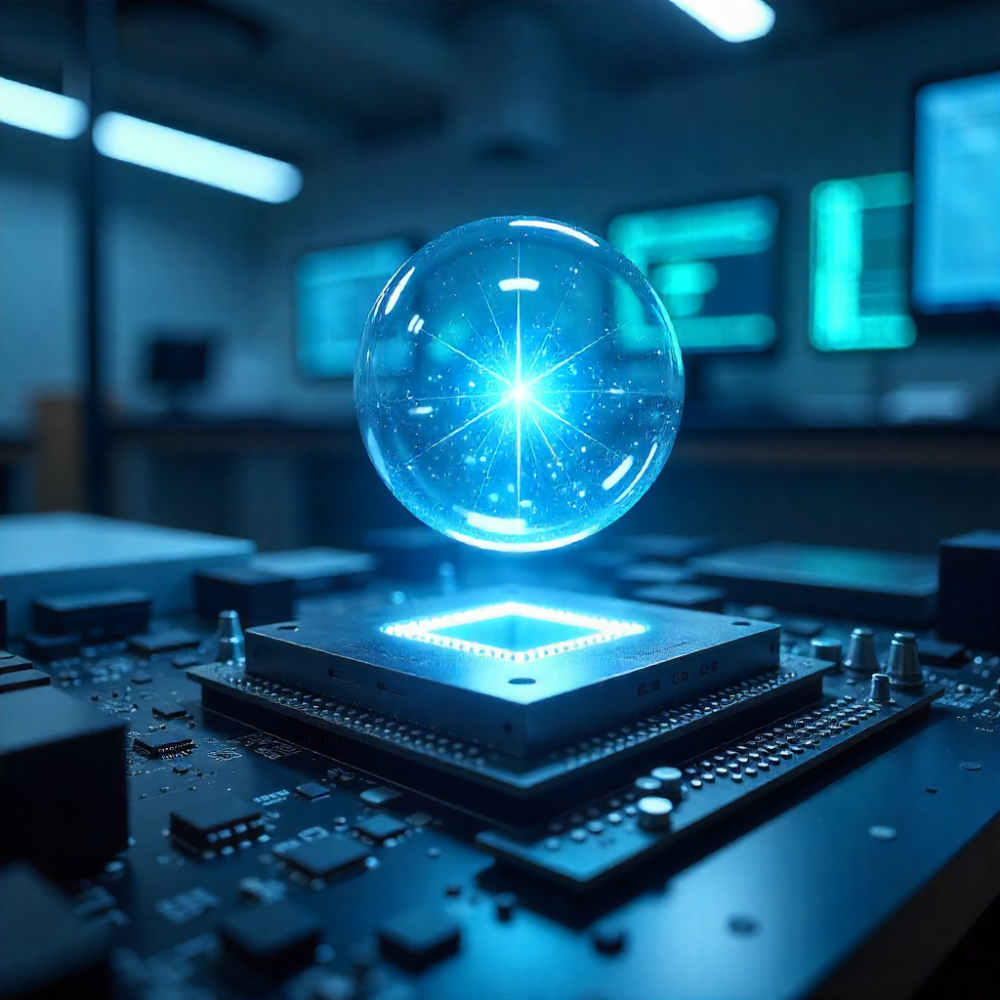
:::

## {.center data-background-image="figures/couloir.jpg" data-background-position="left" data-background-size="50%"}

::::{.row}

:::{.col-6}
:::

:::{.col-6 .p-5}
Il est maintenant indispensable de connaître l’ensemble des composants et leurs interactions pour tirer partie des ressources mises à disposition.

L’expertise demandée est devenue complexe et les choix nombreux.
:::
::::

## Evolution des méthodes mathématiques

:::{.row}
::::{.col}
**Progression parallèle à la loi de Moore**

- Un exemple : résolution de système linéaires creux
- Illustration issue d’une réflexion de la société SIAM en 2001 sur le domaine émergeant “Computational Science and Engineering”
- Valable jusque vers 2005 puis saturation progressive sur les sujets “classiques” de la discipline

:::{.fragment fragment-index=0}
**Emergence de nouvelles approches**

- Depuis 2010 changements de paradigmes et solutions innovantes en analyse numérique → ruptures
- HPC : simuler des problèmes de tailles importante sur des architectures classiques (génie biomédical)
- Exemple : adaptation en temps et en espace (sép. d’opérateur pour intégrer la dynamique en temps) et contrôle d’erreur
:::

<br>

:::{.fragment .text-center .color-0 fragment-index=0}
**Passage à un nouveau chapitre de l’analyse numérique depuis 2010 **
:::

::::
::::{.col-5 .r-stack .text-center}
:::{.fragment fragment-index=0 .fade-out}
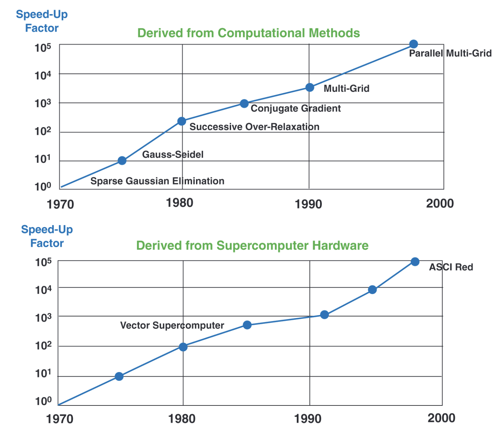{width=80%}
:::
:::{.fragment fragment-index=0 .current-visible}
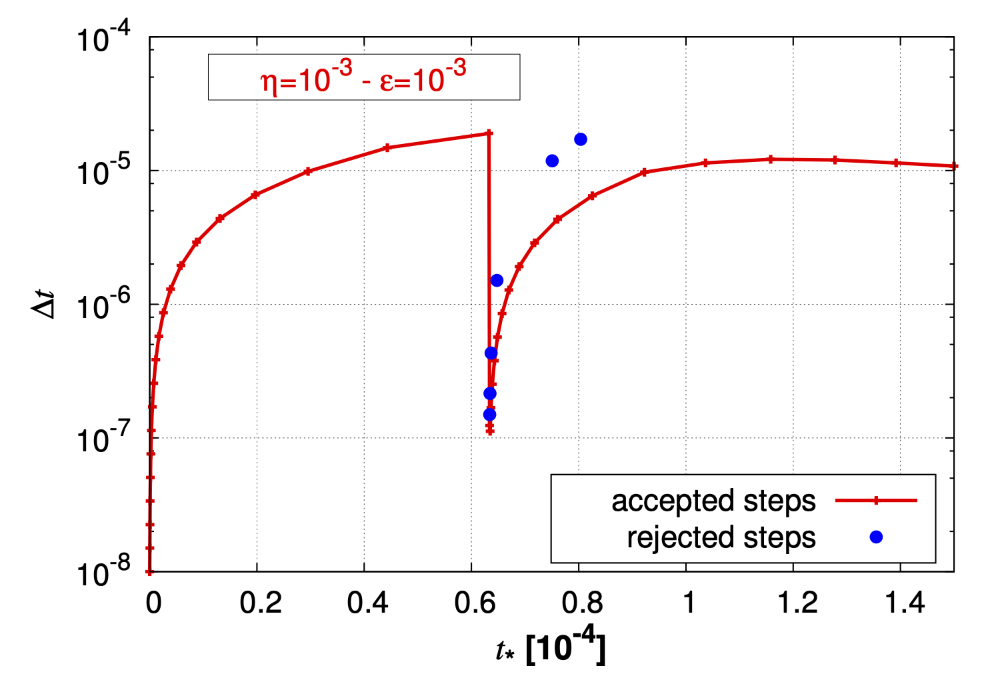{width=80% .video-responsive-30}

<video class="video-responsive-30" data-autoplay loop src="videos/ignition_Re1000.mov" />
:::
::::
:::

## Innovation

:::::{.center-page-vertically-2}
:::{.row}
::::{.col-7 .align-self-center}
Se situe à l’interconnection entre :

::: {.nonincremental}
- Contribution aux nouvelles approches mathématiques, émergence
:::
::: {.nonincremental}
- Nouvelles architectures de calcul et techniques d’implémentation
:::
::: {.fragment fragment-index=1}
- **Enjeux de l’innovation scientifique et technologique = réseau de collab. avec d’autres disciplines et entreprises**
:::
::::
::::{.col}
:::{.r-stack}
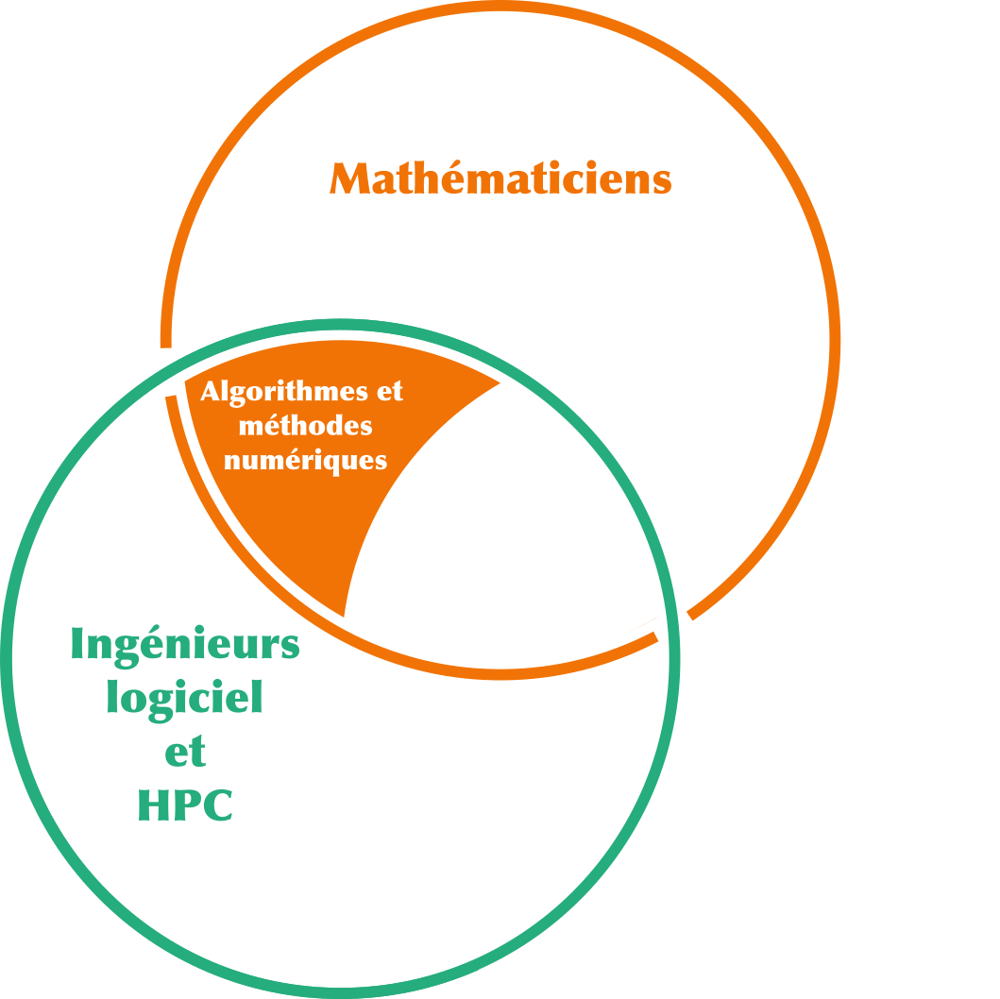

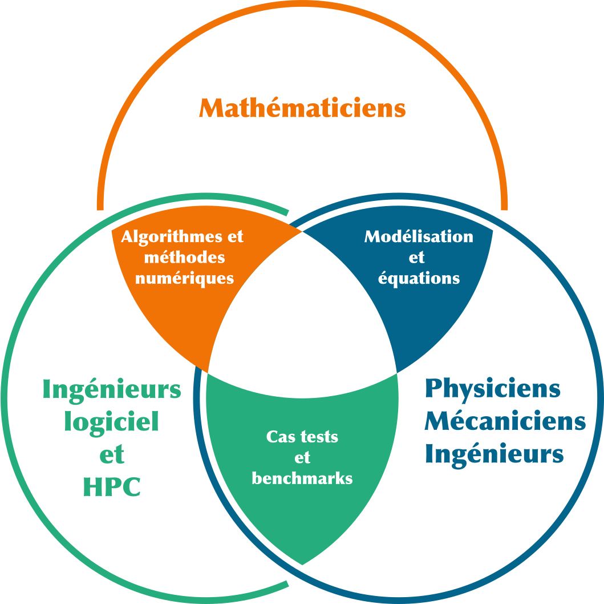{.fragment fragment-index=1}
:::
::::
:::
:::::

---

:::::{.center-page-vertically-2}
:::{.row}
::::{.col-3 .align-self-center .text-center}
{.video-responsive-25}

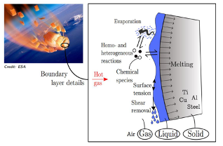{.video-responsive-25}
::::
::::{.col .align-self-center .p-4 .border}

:::{.text-center .color-0 .h1 .display-5}
Écoulements diphasiques multi-échelles
:::

</br>

:::{.text-center  .color}
**Simulation prédictive des phénomènes physiques**

**sur les nouvelles architectures de calcul**
:::

</br>

- Modélisation mathématique innovante
- Méthodes numériques de nouvelle génération
- Développement de code de calcul open-source efficace

</br>

:::{.text-center .color-0 .h1 .display-5}
Conception - sécurité - efficacité
:::

::::
::::{.col-3 .align-self-center .text-center}
{.video-responsive-25}

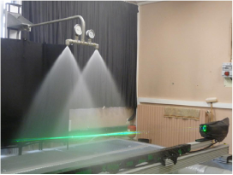{.video-responsive-25}
::::
:::
:::::

---

:::{.center-page}
{width=60%}
:::

## Brouillard de gouttelettes : traité !

:::::{.center-page-vertically-2}
:::{.row .align-items-center}
::::{.col-8 }
**Brouillards de gouttes polydispersés**

- Simulation prédictive de la dynamique des brouillards et de leur évaporation → Structure et dynamique de flamme

:::{.color}
**Combustion**
:::

- Propulsion liquide, solide, Booster Ariane : couplage combustion / acoustique / brouillard polydispersé (instab. thermo-acoustiques)

**Turbulence gaz-gouttes fortement couplée**

- Nouvelle approche aux grandes échelles - ondelettes à divergence nulle

</br>

:::{.text-center .color-0 .h1}
Nouvelle génération de modèles fluides et méthodes numériques précises et efficaces - HPC
:::

::::
::::{.col .align-self-center .text-center}
{.video-responsive-25}

<video class="video-responsive-30" data-autoplay loop src="videos/y1_y3_3d.m4v">
</video>

::::::{.row}
:::::::{.col .text-center}
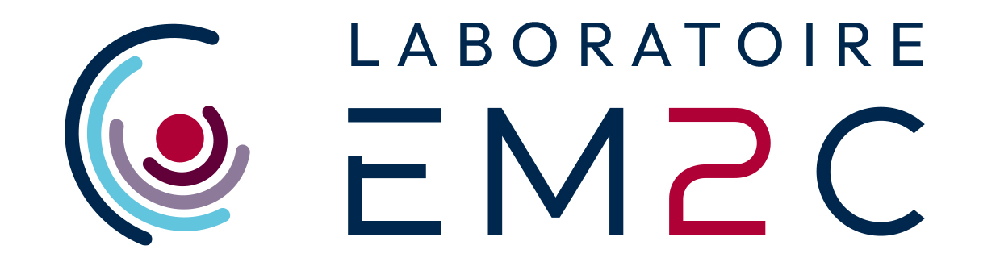{.video-responsive-10}
:::::::
:::::::{.col .text-center}
{.video-responsive-10}
:::::::
:::::::{.col .text-center}
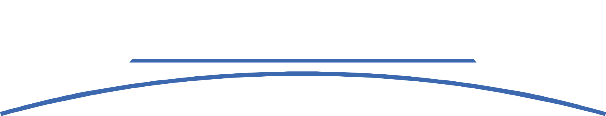{.video-responsive-10}
:::::::
::::::
::::
:::
:::::

## Atomisation - modèle unifié - rupture !

:::::{.center-page-vertically-2}
:::{.row}
::::{.col .border .align-self-center}

:::{.text-center}
**Modèles classiques**
:::

</br>

Régime ***phases séparées***

- Modèles eulériens de mélange bi-fluide avec fraction volumique $\alpha$
- Faible information sur la géométrie de l’interface ($\alpha$, $\nabla \alpha$) - maillage

</br>

Régime ***phases dispersées***

- Modèles eulériens aux moments
- Haute information sur la géométrie de l’interface avec la distribution en taille de gouttelettes ($\alpha$, $\Sigma$, $H$, $G$)

</br>

:::{.color-0}
**Thèse A. Loison, W. Haegeman**

**Post-doc G. Orlando**
:::
::::
::::{.col .text-center .align-self-center}
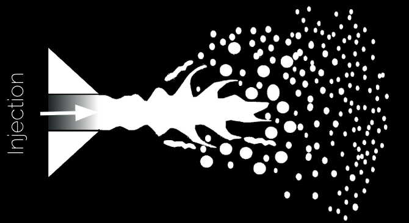{.video-responsive-30}

<video class="video-responsive-30" data-autoplay loop src="videos/droplets-collision-3x.mp4">
</video>
::::
::::{.col .border .align-self-center}

:::{.text-center .color-0}
**Modèle unifié à deux échelles**
:::

</br>

:::{.border .p-1}
::::{.color-0}
***Grande échelle***
::::

- Modèles eulériens de mélange bi-fluide toute topologie avec fraction volumique $\alpha$
:::

</br>

:::{.text-center .fs-3 .border .rounded-pill }
Transfert inter-échelle

::::{.fs-5 .small-lh}
Atomisation primaire, coalescence

géométrie de l’interface via ($\alpha$, $\nabla \alpha$)
::::
:::

</br>

:::{.border .p-1 .m-2}
::::{.color-0}
***Petite échelle***
::::

Modèle de gouttelettes oscillantes base sur  ($\alpha^d$, $\Sigma$, $H$, $G$ + variables dynamiques)

- Géométrie différentielle / modèles cinétiques
:::
::::
:::
:::::
<!--  -->

## Atomisation - modèle unifié - simulation

:::{.text-center}
<video class="video-responsive-40" data-autoplay loop src="videos/large_scale_small_scale_adaptive_contours.mp4" />
:::

:::{.text-center}
<video class="video-responsive-40" data-autoplay loop src="videos/large_scale_small_scale_adaptive_finale.mp4"/>
:::

## Méthode Boltzmann sur réseau

:::{.row}
::::{.col-8}
**Contexte**

- Simulation haute performance du bruit d’un train d'atterrissage (NASA Ames Advanced Supercomputing Division - Launch Ascent and Vehicle Aerodynamics LAVA) 2,28 milliards de degrés de liberté - 12 niveaux
- Simulation sur machine Pleiades (2800 coeurs - deux semaines) Accélération d’un facteur 15 par rapport aux techniques classiques

**Rupture : Thèse Thomas Bellotti **

- Analyse numérique des méthodes (consistance / stabilité)
- Implémentation dans samurai : résolution de plusieurs décades de questions qui se posaient sur l’utilisation de maillages adaptés

</br>

:::{.text-center .color-0}
**Rupture et innovation : simulation plus précise et plus performante**
:::

</br>

Prix de thèse Paul Caseau 2024 Académie des Technologies / Prix de thèse de la Société de Mathématiques Appliquées et Industrielles GAMNI 2024

::::
::::{.col .text-center .align-self-center}
<video class="video-responsive-30" data-autoplay loop src="videos/LBM_Landing_Gear_NASA_compressed.mp4">
</video>

</br>

:::{.row}
::::{.col-8}
<video class="video-responsive-30" data-autoplay loop src="videos/config_12_2_9_1e-3.mp4">
</video>

::::

::::{.col .align-self-center}


</br>


::::
:::
::::
:::

## Samurai

:::{.row}
::::{.col-8}
**Outil pour un ensemble d’applications**

- Physique des plasmas (propulsion électrique, prédiction du temps solaire, electron transpiration cooling…)
- Écoulements diphasiques (propulsion liquide, propulsion aéronautique, moteurs à injection directe, chasse au lancement d’un missile)
- Simulation numérique directe des piles au lithium

<br>

**Innovation**

- Nouvelle structure de données basée sur une algèbre d’ensembles
- Facilité d'implémentation de nouveaux schémas (indépendant de la gestion dynamique du maillage) permettant de créer un écosystème pour les applications

<br>
<br>

:::{.text-center .color-0}
**Code communautaire Open Source**

[https://github.com/hpc-maths/samurai](https://github.com/hpc-maths/samurai)

**Même code pour les deux applications présentées**
:::

::::
::::{.col .text-center}

:::{.row }
::::{.col .align-self-center}

::::
::::{.col .align-self-center}
{width=80%}
::::
:::

:::{.row }
::::{.col .align-self-center}

::::
::::{.col .align-self-center}
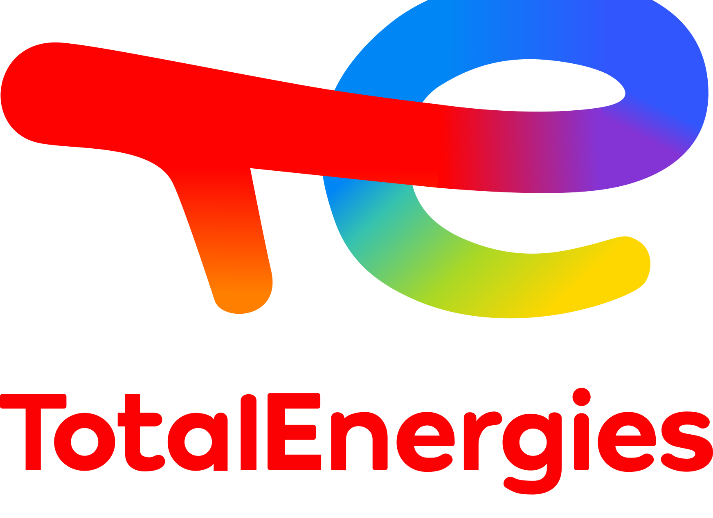{width=60%}
::::
:::

:::{.row }
::::{.col .align-self-center}
{width=30%}
::::
::::{.col .align-self-center}

::::
:::
:::{.row }
::::{.col .align-self-center}
{width=15%}
::::
:::

<br>

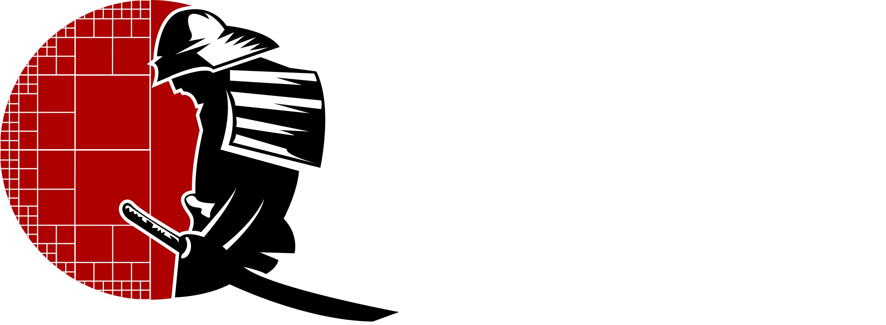{width=80%}
::::
:::
## HPC@Maths

:::{.center-page}
{width=80%}

<br>

::::{.color-0}
**Mise en place depuis 2017 avec l’aide de la Fondation de l’X**

**Impact important sur l’écosystème enseignement-recherche à l’X**
::::
:::

## Mésocentre de Calcul et de données {data-background-image="figures/serveurs.png" data-background-position="right" data-background-size="40%"}

**Ecole polytechnique - IP Paris**

::::{.center-page-vertically-2}
:::{.row}
::::{.col-6 .align-self-center}
- Opérationnel depuis l'été 2021
- 2000 coeurs de calcul pour la communauté des laboratoires initiateurs
- Montée en puissance à 3000 coeurs et nouveaux partenaires
- Communauté autour des méthodes numériques de nouvelle génération et leur implémentation
- “Computational Science” - Collaboration interdisciplinaire
::::
:::
::::

## {data-background-image="figures/foret.png" data-background-position="left" data-background-size="40%"}

:::{.row}
::::{.col}
::::
::::{.col-7}
<h2>Création de l’Unité de Service IDCS</h2>

- Créée en mai 2020 à l’École polytechnique
- Inspirée de ce qui se fait dans les grandes universités (Stanford, EPFL)
- Ensemble d’ingénieurs ASR et CALCUL en soutien aux grands projets d’infrastructures informatiques de l’École et IP Paris
- Réactivité sur évolution des infrastructures et Data Center - Soutien à la communauté
- Vocation à devenir une Unité d’Appui à la Recherche (CNRS)

<br>

:::{.text-center .mt-5 .color-0}
**Effort important mené avec succès sur ces réalisations**

**avec un fort soutien de l’École polytechnique / IPP**

<br>

**Initiative HPC@Maths a eu un rôle clef**
:::
::::
:::

## Enseignement

:::{.center-page}
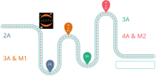{width=90%}

<br>

::::{.color-0}
**Formation mise en place - interaction avec PME & Développement Pédagogie**
::::
:::


## Conclusion

:::{.row}
::::{.col-7 .align-self-center}
**Positionnement pertinent au coeur de l’innovation**

- Expertise Mathématique (CMAP)
- Expertise Informatique (Groupe d’ingénieurs de recherche experts en calcul - développeurs)
- Réseau de collaborations sur les divers axes scientifiques et entreprises
- Production de logiciels open-source

**Création d’un écosystème - École et IP Paris**

**Projet en forte progression**
::::
::::{.col}
{width=80%}
::::
:::
:::{.text-center .color-0 .align-self-end .mt-5}
**Rendu possible grâce au soutien de la Fondation**
:::

## Remerciements

**Etudiants, ingénieurs et collaborateurs**

- Doctorants et post-doctorants
- Ingénieurs Calcul, Valorisation et Project Manager
- Collaborateurs au sein du CMAP et ailleurs
- Collaborateurs industriels, PME, startup

**Ecole polytechnique - IP Paris**

- CMAP
- Unité IDCS
- Pôle teaching and learning center

**Fondation de l’X**

- Direction de campagne
- Toute l’équipe de la Fondation
- Grand donateur pour son écoute, son soutien et ses conseils

##

:::::{.center-page}
{.video-responsive-20}

<br>
<br>

<h4>Merci pour votre attention</h4>

<br>
[HPC@Maths](https://initiative-hpc-maths.gitlab.labos.polytechnique.fr/site/)
:::::

<!--  -->